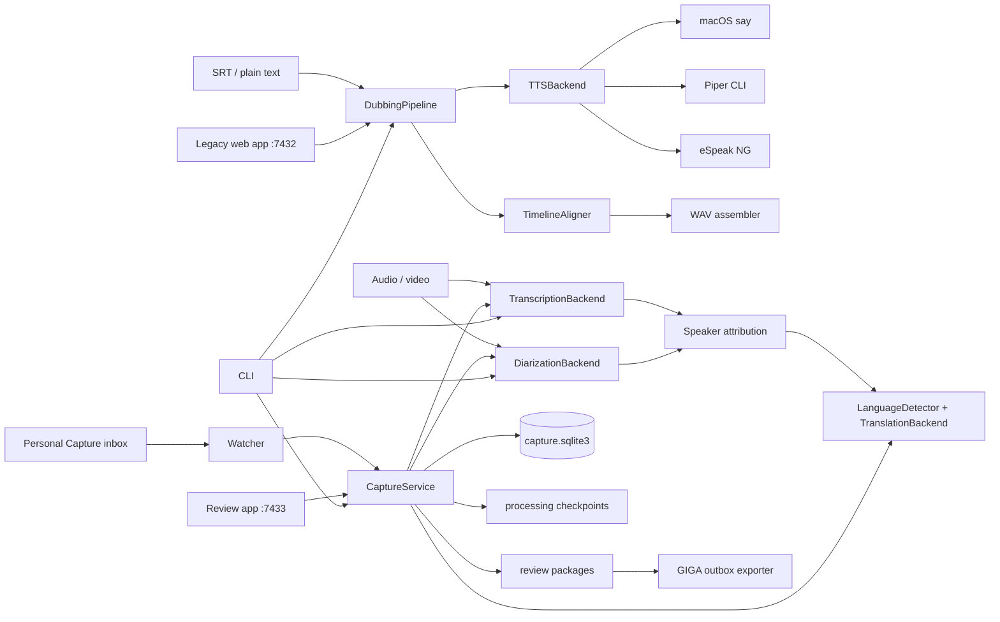

# Architecture

## Real component model



## Process and trust boundaries

- TTS/ASR/diarization/translation run in the invoking Python process; media conversion
  and TTS CLIs are subprocesses.
- The watcher and review server are separate persistent processes sharing SQLite,
  packages, source files, and health JSON.
- SQLite is the capture state authority; checkpoint JSON is the expensive-work resume
  authority; package JSON is review evidence; the outbox SQLite file is delivery
  deduplication state.
- Source audio and speaker-derived data are sensitive. The source inbox is trusted local
  storage; browser uploads and SRT are untrusted input.
- The Tailscale-only claim is deployment convention, not enforced by application code.
  The review app binds all interfaces and relies on token/session authentication.
- The legacy web app has no authentication and also binds all interfaces.

## State machines

Capture states are `processing`, `review`, `approved`, `failed`, and `rejected`.
New hashes begin at `processing`; success moves to `review`; operator action moves to
`approved` or `rejected`; exceptions move to `failed`. Both `failed` and `processing`
are reclaimable on the next scan. This is effectively an automatic retry loop, not a
queued manual retry state.

## Storage

Canonical host paths are:

```text
life-logging/audio-processing/
├── recordings/inbox/        source files
├── processing/<sha256>/     ASR/diarization/translation checkpoints
├── outputs/packages/<sha256>/
├── state/capture.sqlite3
├── outbox/giga/
├── capture.log
├── health.json
└── watcher.lock
```

No source models or recordings are tracked. The repository itself contains ignored
synthetic audio/transcript outputs, a stale build, generated graph data, and a 1.2 GB
virtual environment.
