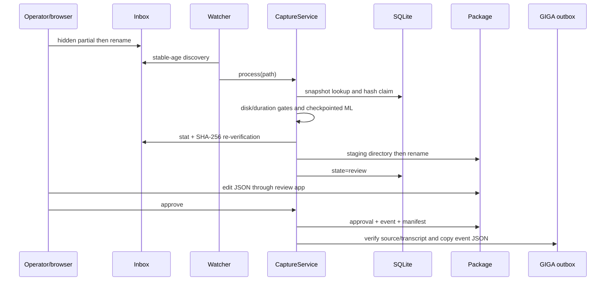

# Data flows

## Subtitle dubbing

`SRT/plain text → UTF-8 parse and timestamp validation → prosody stripping →
per-segment parallel TTS subprocesses → timeline alignment → PCM decode/resample/mix →
WAV and JSON output`.

The assembler enforces a four-hour default timeline cap before allocation. Overlaps are
mixed and clamped. The web path additionally caps the whole multipart body and stores
completed WAVs in a count/byte-bounded process dictionary.

## Long-audio understanding

`audio → ffprobe duration → SHA-256 → FFmpeg 16 kHz chunks → Faster-Whisper/MLX →
atomic chunk JSON → merged transcript → Sherpa chunking → chunk-local labels →
speaker attribution → language detection/NLLB → translation checkpoints`.

ASR chunks are 30 minutes with five-second overlap in production. Segment midpoint
admission deduplicates overlap. Diarization chunks are two hours and deliberately prefix
labels with the chunk ID. The 18-hour logical test exercises 36 ASR and 9 diarization
chunks without allocating an 18-hour media file.

Checkpoint manifests bind source digest, duration, backend identity, and chunk sizing.
They do **not** bind transcription language/task/prompt/word-timestamp options, and the
translation manifest does not bind detector identity.

## Personal Capture

The watcher writes `health.json` after every scan and logs non-replayed outcomes.
It catches scan exceptions, but individual processing exceptions become `failed`
outcomes. The service never deletes source files.

## Evidence inconsistency path

Review saves mutate `transcript.json` and optionally `translation.json`; they do not
regenerate `transcript.txt`, `transcript.srt`, or `translation.txt`. A changed transcript
also leaves each translation segment's `source_text` unchanged. Approval hashes only
`transcript.json`, so contradictory sibling representations can survive into an approved
package.

## Outbox handoff

Approval creates a `giga.personal-capture-event.v1` document with source/transcript
hashes. Export rehashes source and transcript, inserts the event ID into outbox SQLite,
and atomically writes `<capture_sha>.json`. Only the event is copied. Its relative
`transcript_file`/`translation_file` values therefore do not resolve within the outbox.
There is no implemented GIGA consumer in this repository.

## Network/model effects

No explicit HTTP client exists in production modules, but model constructors from
Faster-Whisper/Hugging Face Transformers can fetch named models on cache miss.
The acceptance shell wrapper can invoke pip. Tailscale Serve is configured outside
the application.
