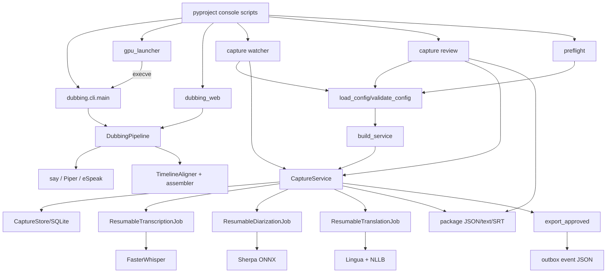

# Directed runtime graph

## High-centrality nodes

- `CaptureService` bridges inbox admission, three ML stages, SQLite, packages, review,
  and outbox.
- `TranscriptionResult` is the data contract shared by ASR, diarization attribution,
  translation, rendering, review, and packaging.
- `dubbing.cli.main` exposes most engine functionality but not the deployed runtime
  configuration path.
- `ffmpeg_executable` is a shared external-tool boundary for ASR and diarization.

## Graphify status

The existing `graphify-out/graph.json` was generated before the current layout and is
stale. A refresh failed because no supported LLM API key is configured. A deterministic
Graphify AST attempt inside `audit/` also failed under Python 3.14 multiprocessing and
returned zero nodes; it is not used as evidence. The authoritative directed graph for
this audit is derived from the full Python AST ledger and source traces. Relationship
confidence is:

- imports, decorators, console targets, routes, subprocess calls: **EXTRACTED**;
- file-convention consumers and operational coupling: **INFERRED** and source-checked;
- future GIGA consumer behavior and cross-host state: **AMBIGUOUS**.
